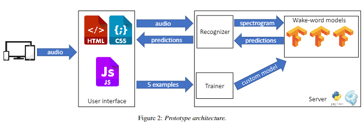

# Wake-word detection

This directory contains prototype for near- and far-field wake-word detection for LV, LT, EE, RU, EN languages.

It consists of following components:
- dataset - original datasets for training and evaluation of wake-word detection model
- dataset\_processed - processed and augmented version of training and testing datasets
- demo - demo web-page and web-service implementing wake-word detection for multiple languages
- train.ipynb - IPython notebook implementing training of the wake-word detection models (tested in Google Colaboratory)


## Audio recordings
To train wake-word models for 5 languages (LV, LT, EE, RU, EN) we organized audio recordings for each language. 
Summarizing the identified requirements, the following audio dataset was created:
- 5 activation words/languages;
- at least 10 speakers for each language;
- 20 activation word samples for each speaker:
- 10 recorded close to the microphone;
- 10 recorded ~2m from the microphone.

Since the wake-word in our case was intended to be the beginning of a sentence that will be immediately followed by further cues, this was also reflected in our audio dataset. When pronouncing only the wake-word, the prosody, stress in the pronunciation of a word/syllable may change, compared to cases where the wake-word would be followed by another word. For this reason, various examples of "\<wakeword> \<verb>" text were prepared for dictation, for example: "Tilde, please write down". This additional verb is then cut from the recording and used to supplement the negative example dataset.

The Latvian, Lithuanian and Estonian samples were mostly recorded by native speakers, but the English and Russian samples were mostly also spoken by Baltic people, for whom these languages are foreign languages. Such an approach made it easier/faster to find volunteers who would be willing to do the recording, and at the same time it corresponds to the predictable scenario of the use of these languages in Baltic region – most often English/Russian languages would be used in meetings to communicate between participants from different countries who do not use these languages on a daily basis. Thus, the obtained data will be closer to the real situation - various accents and pronunciation deficiencies will be found both in the created data set and later, during the use of the system.

Users performed recordings in their own conditions - each with different background noise levels, devices (e.g. from a computer or smartphone) and microphones, thus simulating the diversity of real world conditions.

A total of 1016 audio samples were recorded, of which 1006 remained after filtering out the invalid ones:
- 216 in Latvian (11 speakers);
    - 108 close to the microphone;
    - 108 from ~2m distance;
- 196 in Lithuanian (10 speakers);
    - 97 close to the microphone;
    - 99 from ~2m distance;
- 195 in Estonian (10 speakers);
    - 96 close to the microphone;
    - 99 from ~2m distance;
- 199 in English (10 speakers);
    - 99 close to the microphone;
    - 100 from ~2m distance;
- 200 in Russian (10 speakers).
    - 100 close to the microphone;
    - 100 from ~2m distance.

## Dataset
A set of positive examples was created from the obtained audio recordings. This was done manually by editing each sample using the free audio processing software Audacity. From the original audio file, the exact part of the speech containing only the wake-word and nothing else was cut. 

When model and method was already chosen, it became clear that the length of the input audio during training should be exactly 1s. It was decided to cut the samples of wake-words to the specified length limit. Most of the samples did not need to be modified, however some clips needed to be modified. Most could be adjusted by cutting a small portion of the sound from the beginning or end; cutting out/reducing pauses between words/syllables. The remaining samples, which contain slow pronunciations of the wake-word, could not be adapted in this way. They were modified using Audacity's speed up function, which allows to increase the speed of the sound without changing the pitch of the voice. Almost all clips (~30) that were artificially sped up were from the Lithuanian language dataset.

In addition to the wake-word samples, the model training also requires negative samples - any speech fragments that are not the selected wake-word. It is much easier to obtain such a data set, since practically any fragment of speech is suitable. This set is first built from the same audio recordings. This is done to ensure that the system only learns and gives a positive response to the full wake-word and not just a part of it; it also prevents model to adapt to the peculiarities of the speakers' voice, microphone, ensuring that the model relies only on the speech content. Negative samples were extracted using automatic process by cutting out non-wake-word parts of the audio recordings. Since negative examples are any speech sample that does not contain a wake-word, correct word boundaries were not important.

As a result, sets of negative audio samples of the following size were obtained from the original audio samples:
- 648 samples in Latvian:
    - 324 short distances;
    - 324 long distances (~2m);
- 588 examples in Lithuanian:
    - 291 close distances
    - 297 long distance
- 585 examples in Estonian:
    - 288 short distances
    - 297 long distance
- 597 examples in English:
    - 297 close distances
    - 300 long distance
- 600 samples in Russian:
    - 300 close range
    - 300 long distance.

In addition negative example set was extended with public Multilingual Spoken Word Corpus (MSWC) [https://mlcommons.org/en/multilingual-spoken-words/]

Both negative and positive samples can be found in "dataset" directory

## Data augmentation

## Prototype

### Introduction
Our wake-word recognizer architecture is based on approach from [https://github.com/harvard-edge/multilingual_kws]. It consists of a neural network classifier that receives a 49x40 spectrogram of the 1 sec long audio as input. This neural network classifies input into one of the three classes: (1) wake-word, (2)
other speech, (3) background noise.

The core of our neural network classifier is a multilingual speech embedding model. The speech embedding model, similar to word embedding models for text, maps speech to a vector-space by retrieving phonetic, acoustic and other information from the spectrogram. The speech embedding network is based on the EfficientNet-B0 with 6 additional dense layers and a softmax layer on top. This neural network was pre-trained to classify speech input in to 761 classes, corresponding to 760 different words from 9 languages and background sound class. For wake-word detection the last layer is replaced with a softmax layer which outputs the probability of the input belonging to one of the 3 classes.

The demonstration prototype consists of a front-end HTML/JS page and a back-end server (see Figure 2), which communicate using Websocket protocol. The front-end records audio using the Javascript Web Audio API directly from the device’s microphone. The audio is streamed to the back-end server as raw PCM mono using 1 sec sliding window with 0.2 sec overlap. The server processes each 1 sec chunk of audio independently by performing sampling rate conversion (to 16 kHz), computing spectrogram and feeding it into wake-word recognition model. The output of the model (class probabilities) is then sent back to the front-end. Then the front-end makes the decision whether wake-word was detected using the threshold that can adjusted by the user.



### Trying out the pre-trained models
The easiest way to test the pre-trained models is to use Docker.

First, build the Docker image:
```bash
   cd demo
   docker build -t wakeword-demo .
```

Next, run the Docker container and set forwarding for ports 8083 and 8080:
```bash
   docker run -p 8080:8080 -p 8083:8083 wakeword-demo:latest 
```

Port 8080 is for regular HTTP endpoint, while port 8083 provides HTTPS (via self-signed certificate). Most browsers will require you to use HTTPS to allow access to the microphone. 

Finally, open the demonstration web-page (https://localhost:8083) in your browser to try out the wake-word detection.

The Docker image also supports GPU acceleration, that can be enabled as follows:
```bash
    docker run --gpus all -p 8080:8080 -p 8083:8083 wakeword-demo:latest 
```

### Few-shot learning
The front-end also enables user to record 5 examples of new custom wake-word and submit them to back-end server for model training. The server creates negative examples by cutting
parts of 5 submitted recordings and padding them with silence. Negative example set is further expanded by adding background noise examples and random 20 files from [MSWC](https://mlcommons.org/en/multilingual-spoken-words/). On top of data augmentation performed in the [base model](https://github.com/harvard-edge/multilingual_kws) we apply the following augmentation functions from Audiomentations library to increase the number of examples 7-fold:
- ApplyImpulseResponse - apply impulse responses from MIT IR Survey dataset [3];
- AddGausianNoise - add Gaussian noise;
- Gain - reduce the volume by a random amplitude factor;
- PitchShift - pitch shift the sound up or down without changing the tempo;
- TimeStretch - change the speed or duration without changing the pitch;
- Normalize - normalize the volume.
These additional augmentations improve AUC (area under the curve created by plotting the false negative rate against the false positive rate) by 20-40% in case of the 5-shot learning.

During the training, the model output layer and last 20 layers of the embedding network are fine-tuned. Finally, a smaller student model is automatically created from the trained model using knowledge distillation. The dimensions of additional dense layers on top of EfficientNet B0 are decreased 16 times. The resulting distilled model have almost 3 times less parameters, 4.2M instead of 13M parameters, while the size is decreased nearly 7 times, from 155MB to 22.4MB. This allows to run the wake-word detection on a smaller hardware.

To easiest way to test the few-shot learning you need to build the Docker image:
```bash
   cd demo
   docker build -t wakeword-demo .
```

Next, run the Docker container and set forwarding for ports 8083 and 8080:
```bash
   docker run -p 8080:8080 -p 8083:8083 --gpus all wakeword-demo:latest 
```

If your machine does not have GPU, you can omit `--gpus all` from the command. Fine-tuning on CPU is slower and maybe take more than 10 minutes.

Finally, open the recorder web-page (https://localhost:8083/record) in your browser and record audio examples of new wake-word. Model will be automatically trained and added to demonstration UI (https://localhost:8083) for testing.

## Video
